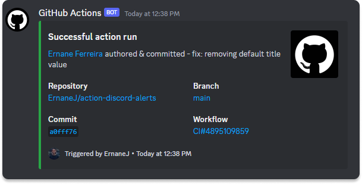

<h1 align="center">
  <strong>Action Discord Alerts 📢</strong>
</h1>

<p align="center">
  <a href="#-project">Project</a>&nbsp;&nbsp;&nbsp;|&nbsp;&nbsp;&nbsp;
  <a href="#-use">Use</a>&nbsp;&nbsp;&nbsp;|&nbsp;&nbsp;&nbsp;
  <a href="#-arguments">Arguments</a>&nbsp;&nbsp;&nbsp;|&nbsp;&nbsp;&nbsp;
  <a href="#-test">Test</a>&nbsp;&nbsp;&nbsp;|&nbsp;&nbsp;&nbsp;
  <a href="#-build">Build</a>&nbsp;&nbsp;&nbsp;|&nbsp;&nbsp;&nbsp;
  <a href="#-contribute">Contribute</a>&nbsp;&nbsp;&nbsp;
</p>

<br/>

<p align="center">
  <a href="https://github.com/ErnaneJ/action-discord-alerts/actions/workflows/ci.yaml">
    
  </a>
</p>

<p align="center">
  <p align="center">
  
</p>

## 💻 Project

Action aimed at facilitating continuous delivery. You only need a discord webhook to track the completion status of your workflow.

## 🚀 Use

```yml
  # ...
  - name: Action Discord Alert
    if: always()
    uses: ErnaneJ/action-discord-alerts@main
    with:
      webhook: ${{ secrets.DISCORD_WEBHOOK }}     
      status: ${{ job.status }}
```

## 📑 Arguments

| Argument       | Required  | Default               | Description                                                                                                                              |
|-----------------|-----------|-----------------------|------------------------------------------------------------------------------------------------------------------------------------------|
| **webhook**     |  `true`   | -                     | Discord webhook.                                                                                                                         |
| **status**      |  `false`  | ${{ job.status }}     | Job status. Should be bound to job.status. Default to success.                                                                           |
| **content**     |  `false`  | -                     | Standard message outside the information card. Can be used to mention users.                                                             |
| **title**       |  `false`  | -                     | For custom title only. By default it is filled with action job status.                                                                   |
| **description** |  `false`  | -                     | For custom description only. By default it is filled with author and commit message.                                                     |
| **image**       |  `false`  | -                     | Url of an Image that will be attached to the information card                                                                            |
| **thumbnail**   |  `false`  | -                     | Url of an thumbnail that will be attached to the information card                                                                        |
| **color**       |  `false`  | -                     | Overwrite the defined color for the info card highlight. By default this color is set by job status.                                     |
| **username**    |  `false`  | -                     | Overrides Discord webhook username. By default we have Github Action.                                                                    |
| **avatar_url**  |  `false`  | -                     | Overrides Discord webhook avatar url. By default we have Github image url.                                                               |
| **event_info**  |  `false`  | `true`                | Decide whether or not to display drill-downs for some information. By default it is shown.                                               |
| **timestamp**   |  `false`  | `true`                | Controls whether to show the timestamp on the info card. Default pos is shown.                                                           |
| **verbose**     |  `false`  | `false`               | Controls the sampling of some information when the script runs. For example, the payload that is assembled before being sent to discord. |

## 💡 Test

The tests use Jest. To run them use:

```bash
npm run test

# To hide warnings set the silent environment variable.
export SILENT=true
```

## 🔥 Build

```bash
npm run build # use @vercel/ncc
```

## 🎉 Contribute

If you would like to implement or improve any feature feel free to submit a pull request. I would love to receive!

<hr/>

<p align="center">
  Developed with ❤ by <a target="_blank" href="https://ernanej.github.io/my-linktree/">Ernane Ferreira</a>. 👋🏻
</p>
